# สถาปัตยกรรมไปป์ไลน์ PetPaws (Lab 10)

ไปป์ไลน์ 2 ตัวใน repo เดียว: `taskflow-api` (NestJS, [Jenkinsfile](../Jenkinsfile)) และ `taskflow-mobile` (Flutter, [Jenkinsfile.mobile](../Jenkinsfile.mobile)) ทั้งคู่เป็น Multibranch Pipeline ที่ถูกสั่งด้วย GitHub webhook

```mermaid
flowchart LR
    dev([Developer push / PR]) --> gh[GitHub<br/>Jadsadar/Lab-jenkins]
    gh -- webhook ผ่าน ngrok --> jenkins[Jenkins controller]
    prom[(Prometheus)] -- scrape /prometheus --> jenkins
    prom --> graf[Grafana dashboard]

    subgraph API["taskflow-api (linux-build agent + kind pod)"]
        direction LR
        s1[Secrets<br/>Gitleaks] --> qc
        subgraph qc["Quality Checks (parallel, failFast)"]
            direction TB
            a1[Lint + Unit Test<br/>K8s pod]
            a2[SAST<br/>ESLint / Semgrep]
            a3[SCA<br/>npm audit]
            a4[IaC<br/>tf validate / tfsec / checkov / ansible-lint]
        end
        qc --> sbom[SBOM Syft<br/>+ Cosign sign] --> pol[Policy Gate<br/>OPA]
        pol --> sq[SonarQube +<br/>Quality Gate 70%] --> e2e[E2E<br/>Playwright]
        e2e --> img[Build Image<br/>SHA tag] --> trivy[Container Scan<br/>Trivy]
        trivy --> hg{{Pipeline Health Gate<br/>≥ 90% of last 20}}
        hg --> appr[/Approval: Deploy?/] --> bg[Blue/Green deploy<br/>kind cluster]
        bg -. smoke test fail .-> rb[Auto rollback<br/>Service → old color]
    end

    subgraph MOB["taskflow-mobile (kind pod)"]
        direction LR
        m0[flutter pub get] --> mc
        subgraph mc["Checks (parallel)"]
            direction TB
            m1[flutter analyze]
            m2[flutter test --coverage]
            m3[osv-scanner]
        end
        mc --> m4[Debug APK<br/>ทุก branch] --> mhg{{Health Gate}} --> m5[Signed Release AAB<br/>main เท่านั้น]
    end

    jenkins --> API
    jenkins --> MOB
    hg -. query .-> prom
    mhg -. query .-> prom
    API -- email --> mail[Mailpit<br/>NOTIFY_EMAIL]
    MOB -- email --> mail
    creds[(Jenkins Credentials<br/>sonar-token, cosign-key,<br/>kind-kubeconfig,<br/>android-keystore)] -. withCredentials .-> API
    creds -. withCredentials .-> MOB
```

## สเตจไหนรันที่ branch ไหน

| สเตจ | feature/* | PR / develop | main | demo/* |
|---|---|---|---|---|
| Secrets, Quality Checks, SBOM, Policy Gate | ✅ | ✅ | ✅ | ✅ |
| SonarQube + Quality Gate, E2E | ติ๊ก `FULL_CHECKS` | ✅ | ✅ | ติ๊ก `FULL_CHECKS` |
| Build Image + Trivy | ✅ | ✅ | ✅ | ✅ |
| Deploy Staging | – | develop | – | – |
| Pipeline Health Gate | – | – | ✅ | ✅ (ประวัติขั้นต่ำ 1 บิลด์) |
| Approval + Blue/Green Deploy | – | – | ✅ | – |
| Terraform / Ansible | ติ๊ก `APPLY_INFRA` | ติ๊ก `APPLY_INFRA` | ติ๊ก `APPLY_INFRA` | ติ๊ก `APPLY_INFRA` |
| Mobile: analyze, test, osv, Debug APK | ✅ | ✅ | ✅ | ✅ |
| Mobile: Signed Release AAB | – | – | ✅ | – |

## เกณฑ์ที่บล็อกโค้ด (Gates)

| Gate | บล็อกเมื่อ |
|---|---|
| Gitleaks | พบ secret ในประวัติ git |
| Lint / Unit Test / flutter analyze / flutter test | lint error หรือเทสต์ไม่ผ่าน |
| ESLint Security / Semgrep | พบรูปแบบโค้ดที่ไม่ปลอดภัยระดับ error |
| npm audit + OPA Policy Gate | มีช่องโหว่ระดับ critical |
| osv-scanner | `pubspec.lock` มีแพ็กเกจที่มีช่องโหว่ |
| tfsec / checkov | Terraform ตั้งค่าไม่ปลอดภัย |
| SonarQube Quality Gate | coverage ทั้งโปรเจกต์ต่ำกว่า 70% |
| Trivy | image มีช่องโหว่ HIGH/CRITICAL |
| Pipeline Health Gate | บิลด์สำเร็จน้อยกว่า 90% ของ 20 บิลด์ล่าสุด |
| Approval | ไม่มีคนกด Deploy ภายใน 30 นาที |
| Blue/Green smoke test | `/health` ของสีใหม่ไม่ตอบ → rollback อัตโนมัติ |

## ความลับ

ไม่มีรหัสผ่านหรือ token อยู่ใน Jenkinsfile ทุกค่ามาจาก Jenkins Credentials ผ่าน `withCredentials` หรือ `credentials()` ได้แก่ `sonar-token`, `cosign-key`/`cosign-pass`, `kind-kubeconfig`, `localstack-aws`, `lab08-ssh-key`/`lab08-ssh-pub`, `android-keystore`/`android-keystore-pass` ส่วนที่อยู่อีเมลปลายทาง (`NOTIFY_EMAIL`) และ SMTP ตั้งไว้ใน Manage Jenkins
